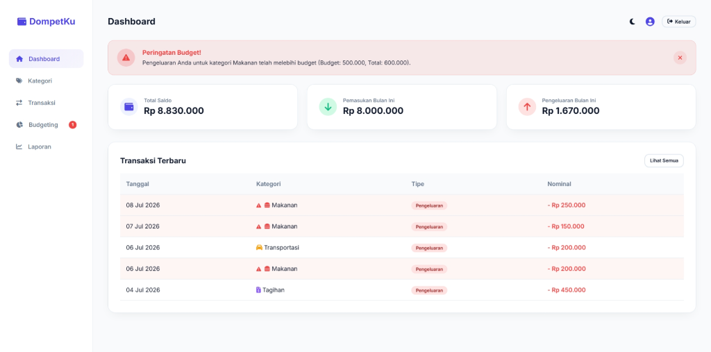
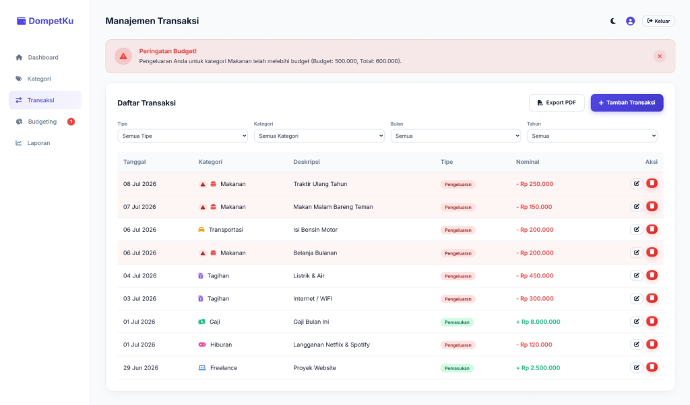
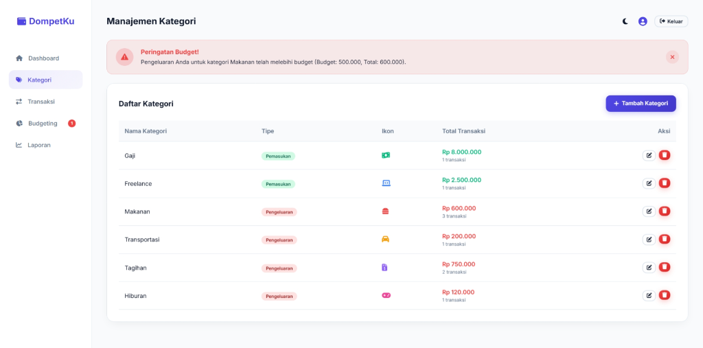
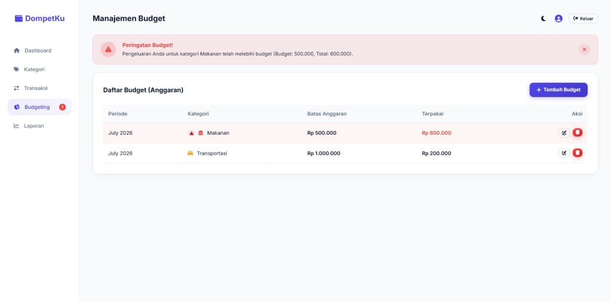
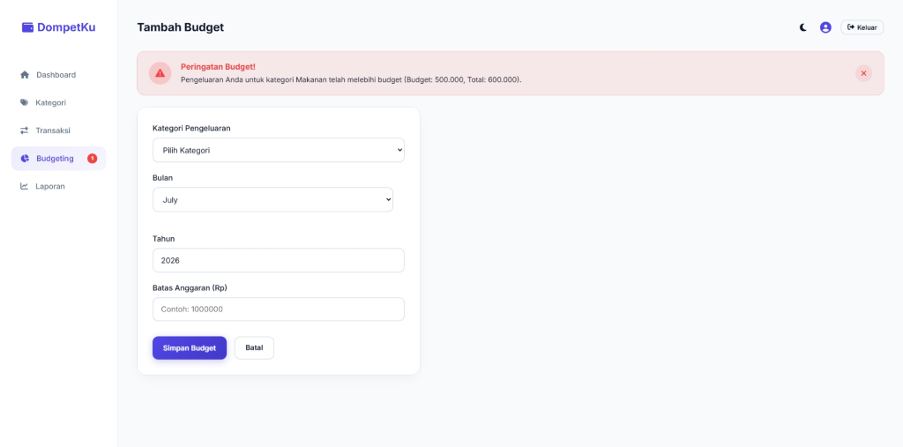
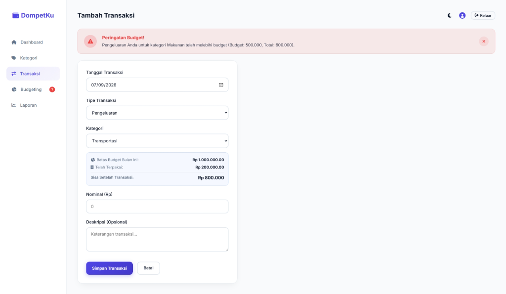
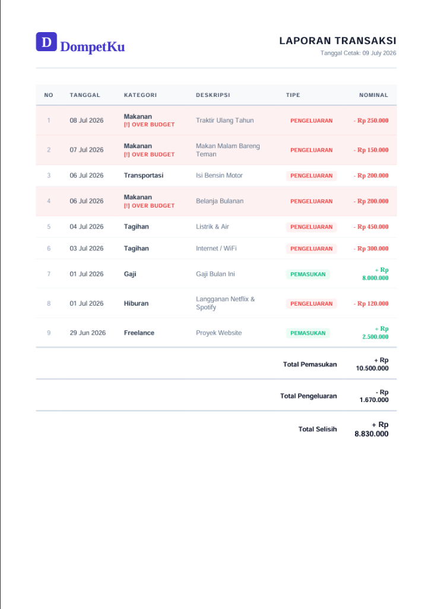
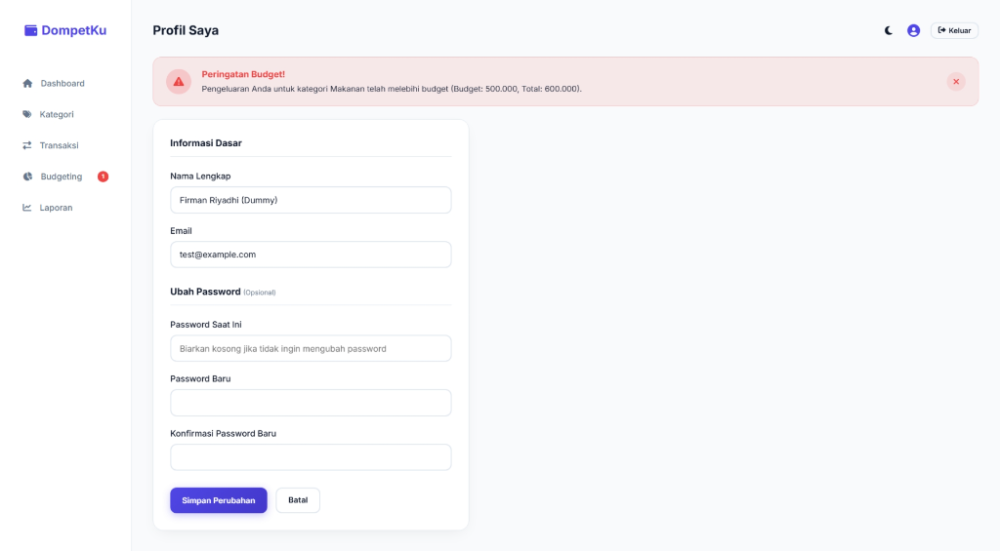
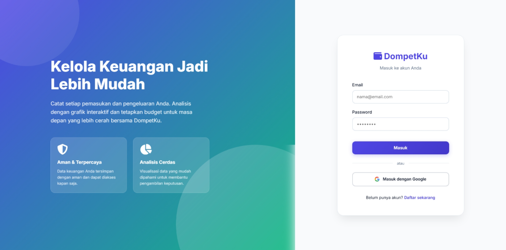
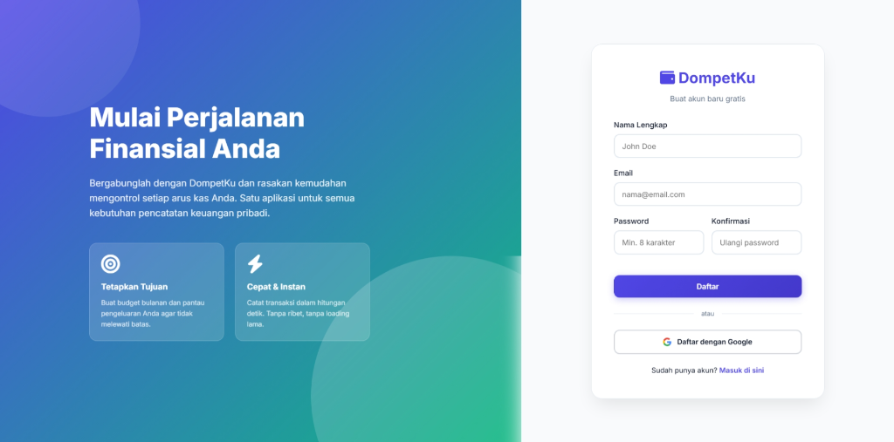

# DompetKu 💸

DompetKu adalah aplikasi pencatatan keuangan pribadi modern yang dibangun menggunakan kerangka kerja **Laravel**. Aplikasi ini dirancang untuk membantu Anda memantau pemasukan dan pengeluaran, mengatur anggaran (budget) bulanan, serta mendapatkan laporan keuangan yang jelas dan mudah dipahami.

## 🌟 Fitur Utama

- **📊 Dashboard Interaktif**: Lihat ringkasan total saldo, pemasukan, dan pengeluaran bulan ini, beserta daftar transaksi terbaru.
- **📝 Manajemen Transaksi**: Catat setiap transaksi (pemasukan/pengeluaran) dengan mudah. Dilengkapi fitur filter pencarian berdasarkan tipe, kategori, dan rentang waktu.
- **🏷️ Kategori Kustom**: Buat dan kelola kategori transaksi sesuai kebutuhan Anda (misal: Gaji, Makanan, Transportasi). Anda dapat memilih ikon dan warna unik untuk setiap kategori.
- **🎯 Anggaran (Budgets)**: Tetapkan target batas pengeluaran untuk setiap kategori setiap bulannya.
- **🚨 Peringatan Over-budget**: Sistem akan memberikan peringatan visual (*real-time* maupun dalam tabel) jika Anda hampir atau sudah melewati batas anggaran yang ditentukan.
- **📄 Ekspor Laporan**: Unduh laporan transaksi Anda dalam bentuk PDF berdesain modern dan elegan.
- **🔐 Otentikasi Google**: Daftar atau masuk ke dalam aplikasi dalam hitungan detik menggunakan akun Google (didukung oleh Laravel Socialite).
- **👤 Profil Pengguna**: Halaman khusus untuk memperbarui nama, alamat email, dan kata sandi Anda.
- **🌓 Mode Gelap/Terang**: Ubah tema antarmuka sesuai dengan kenyamanan mata Anda melalui satu sentuhan tombol.

## 📸 Tangkapan Layar (Screenshots)

**Dashboard Utama**


**Manajemen Transaksi**


**Manajemen Kategori**


**Manajemen Anggaran (Budget)**


**Tambah Budget**


**Tambah Transaksi**


**Ekspor Laporan PDF**


**Profil Pengguna**


**Halaman Otentikasi (Login & Register)**



## 🚀 Panduan Instalasi (Development)

Ikuti langkah-langkah di bawah ini untuk menjalankan DompetKu di lingkungan lokal Anda:

1. **Clone repositori ini** (jika Anda menggunakan Git):
   ```bash
   git clone https://github.com/username/dompetku.git
   cd dompetku
   ```

2. **Instal dependensi Composer & NPM**:
   ```bash
   composer install
   npm install
   ```

3. **Salin file konfigurasi *environment***:
   ```bash
   cp .env.example .env
   ```

4. **Siapkan konfigurasi Database & Google API**:
   Buka file `.env` dan atur koneksi database Anda (SQLite/MySQL). 
   Selain itu, untuk menggunakan fitur login Google, tambahkan kredensial berikut:
   ```env
   GOOGLE_CLIENT_ID="ISI_CLIENT_ID_ANDA"
   GOOGLE_CLIENT_SECRET="ISI_CLIENT_SECRET_ANDA"
   GOOGLE_REDIRECT_URI="http://localhost:8000/auth/google/callback"
   ```

5. **Generate *Application Key* dan jalankan migrasi database**:
   ```bash
   php artisan key:generate
   php artisan migrate
   ```

6. **Jalankan server aplikasi**:
   ```bash
   php artisan serve
   ```
   *Anda juga dapat menjalankan `npm run dev` di terminal terpisah untuk mengkompilasi aset frontend (CSS/JS).*

Aplikasi kini dapat diakses melalui browser Anda di `http://localhost:8000`.

## 🛠️ Teknologi yang Digunakan
- **Backend:** [Laravel](https://laravel.com)
- **Frontend:** HTML5, Vanilla CSS, JS
- **Database:** SQLite / MySQL (sesuai konfigurasi)
- **Otentikasi Tambahan:** Laravel Socialite (Google Auth)
- **Pembuat PDF:** Laravel DomPDF
